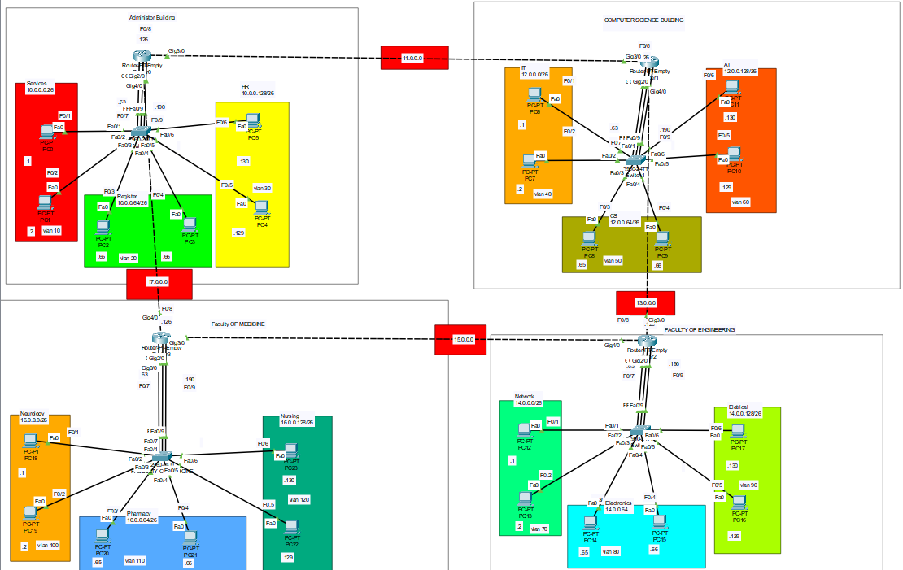

# 🎓 University Network Design - Cisco Packet Tracer

This project is a **university campus network simulation** created using **Cisco Packet Tracer**.  
It represents the design and configuration of a scalable network infrastructure connecting multiple faculties and the administration building.

---

## 🖼️ Network Topology

*(The diagram shows the interconnected faculties and administration building with VLANs, routers, and switches.)*

---

## 🔹 Project Overview
The network is built to simulate a real university environment, including:

- **Administration Building**  
- **Faculty of Computer Science**  (Ai, It, Cs)
- **Faculty of Medicine** (Neurology, Nursing, Pharmacy)  
- **Faculty of Engineering** (Electronics, Network, Electrical)  

Each building is interconnected via backbone routers, and departments are segmented with VLANs and subnets.

---

## 🔹 Key Features
- 🖧 **VLAN segmentation** for different departments.  
- 🌐 **Subnetting** with organized IP addressing schemes.  
- 🔗 **Routers & Switches configuration** for inter-building connectivity.  
- 🖥️ **Centralized Servers** hosted in the Administration building.  
- 📡 **Routing protocols** to enable communication across all faculties.  

---

## 🔹 Skills Demonstrated
- Network design & topology planning.  
- VLAN and subnet configuration.  
- Routing & switching in enterprise-scale networks.  
- Troubleshooting & simulation in Cisco Packet Tracer.  

---

## 🚀 How to Use
1. Open the project file (`Network.pkt`) in **Cisco Packet Tracer**.  
2. Explore the topology of the university network.  
3. Review VLANs, IP addressing, and routing configurations.  

---

## 📌 Tools & Technologies
- **Cisco Packet Tracer**  
- **Subnetting & VLANs**  
- **Routing Protocols**  

---

## 📖 About
This project was developed as a **practical networking exercise** to demonstrate my skills in designing, configuring, and troubleshooting large-scale campus networks.
